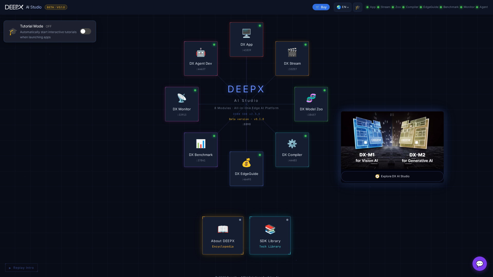

# The Hub

The **hub** is the home page that ties the studio together. Every tool opens from here and
runs under the hub's single address; the hub proxies each module, so one URL is all you
need (and all you can reach from another computer — module ports listen on the board only).

## Layout

- **Prompt box** — *Describe anything. Run it on DX-M1.* Write what you want in plain words
  and click **Build it**. The hub either opens the module that already does it (for example,
  "compile yolo26n to DXNN" opens DX Compiler), or runs DX Agent Dev right on the home page,
  where you follow its activity and answer its questions. Example chips under the box fill in
  a ready-made request; the **Agent** row picks the coding agent, model, effort and mode.
- **Tool cards** — the eight tools plus **SDK Library** and **About DEEPX**. Cards show live
  facts where a module can count them (for example *26 demos · 12 groups* for DX App, the
  catalogue size for Model Zoo). Click a card to open the tool; the hub chrome stays in
  place.
- **DX-M1 widget** (left) — the NPU in this computer: cores, temperature, clock and power.
  Click it to open DX Monitor.
- **Measured on DX-M1** (right) — a model's FPS measured on this device, and how many models
  and tasks were measured. Click it to open DX Benchmark.
- **Go deeper at DEEPX Developers** — the bar at the bottom links to Get Started, S/W
  Download, Tech Docs, Documents, Model Zoo, GitHub and deepx.ai.
- **Explore DX AI Studio** and **Physical AI ecosystem** — the two chips under the heading
  open the platform overview (every module at a glance) and the DEEPX ecosystem page.

If a module is not up yet, opening it shows a loading state; the hub keeps retrying for
about 30 seconds, then shows **Module unavailable** with **Retry**.

## Top bar

From left to right on the right side:

- **Buy** — the DEEPX store.
- **Language** — the six languages (see below).
- **Theme** — cycles dark → light → system.
- **Connected browsers** — appears when the studio is reachable from the network. It lists
  the browsers paired from other computers (browser, IP, last active, paired date) with
  **Disconnect**; on the board it also shows the address other computers open. See
  [Remote access & security](01_Installation_and_Launch.md#remote-access-security).
- **Tutorial** — opens the tutorial contents for the current view.

The global **DX AI Studio Help** assistant is the round chat button at the bottom right of
every view; set or clear its API key from its settings. It supports several providers,
including fully offline ones (a local server or a signed-in coding CLI) — see
[SDK Library & About](11_SDK_Library_and_About.md). Its header also links to the web
**DEEPX Agent**.

## Guided tutorials

**Tutorial Mode** (the switch at the top right of the home, next to **Replay Intro**) is on
by default. With it on, the first visit to the home runs a short walkthrough, and opening a
tool opens that tool's tutorial contents — pick a section or **Start from Beginning**. Steps
have **Prev / Skip / Next** (arrow keys work too); **Esc** ends the tour. The **Tutorial**
button in the top bar opens the contents at any time.

## Navigating

- Click a card to enter a tool; use the logo or the browser **Back** button to return home.
- The current tool and view are reflected in the **URL**, so links are shareable and
  reload-safe (for example, a DX EdgeGuide recommendation or an SDK Library document).
- **Keyboard shortcuts** — `Alt`+`1`…`8` open a tool directly. `Esc` closes the topmost
  thing first — the chat, the tutorial, a search, a dialog — and only then leaves the tool.

## Language

The entire studio is available in **6 languages** — English, 한국어, 日本語, 简体中文,
繁體中文, Español. Switch from the top bar at any time; every open tool follows, and the
choice persists.
