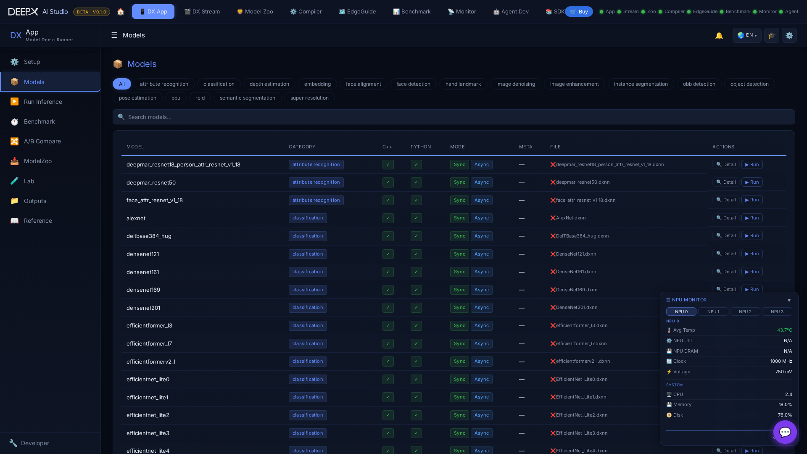

# DX App

Run AI inference on the DEEPX NPU from your browser — pick a model, run it on images,
video, a camera or an RTSP stream, watch live results, and benchmark or compare models.

## Using it

The module opens on a set of pages (top tabs):

- **Setup** — guided environment check; run it first so the NPU / runtime is ready.  
- **Models** — the model list across 27 AI tasks (detection, classification, segmentation,
  pose, depth, super-resolution, 3D object detection, PPU and more), drawn from the Model
  Zoo catalogue; open a model for details or its graph.  
- **Run Inference** — pick a **category → model → input**, then Run. Two tabs:  
    - **Single** — one image or video. Inputs adapt to the category: a sample image, your
      **own uploaded image**, or a video (some tasks are image-only; special inputs like 3D
      LiDAR `.bin` appear where they apply). Image runs show a **before/after compare slider**.  
    - **Continuous** — video, camera or RTSP streamed live, with several slots side by side.
      A model that takes still images only is refused with an explanation.  
- **Run Demo** — 26 ready-made demos in 12 groups on one stage: choose a demo, the input
  (image or video), C++ or Python, Sync or Async, and run. Video runs stream live with FPS.  
- **Benchmark** / **A/B Compare** — measure a model's throughput and compare models side by
  side; Benchmark can run several models in a batch and **export a report**.  
- **ModelZoo** — browse and download additional models into the app (public or air-gapped
  source, Q-Lite / Q-Pro variants, batch cart).  
- **Lab** — DX App Composer, Add Model, Create Task, Experiment and Safety Center: guided
  wizards with a change preview and rollback (advanced use).  
- **Outputs** — browse and manage saved inference results (grid / table, filters, preview).  
- **Reference** — searchable in-app feature and parameter guides.  

!!! note "Live runs"
    Continuous runs and Run Demo video draw the example's window on a virtual display and
    stream it to the browser. They need `xvfb` and `python3-pil` on the board — see
    [Prerequisites](01_Installation_and_Launch.md#prerequisites).

From the Run page you can also **Export Model Package** — bundle a model's source, config,
and file (C++ / Python / both) for reuse.  

Works **without an NPU** too — every page falls back to mock data so you can explore the UI.  

!!! note "Related"
    Run the `.dxnn` files produced by **[DX Compiler](04_DX_Compiler.md)**; the same
    NPU telemetry is visualized live in **[DX Monitor](07_DX_Monitor.md)**.  
