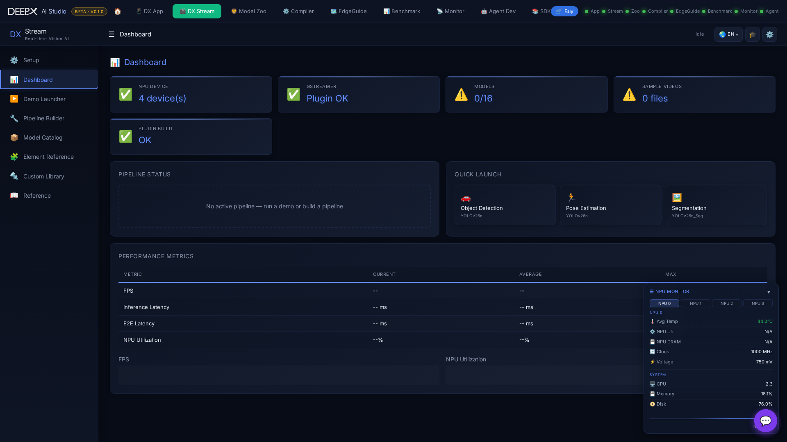

# DX Stream

Build and run real-time GStreamer vision-AI pipelines on the DEEPX NPU from your browser,
with live playback — WebRTC on the board or LAN, MJPEG from another computer or a tunnel.  

  

## Pages

- **Setup** — one-click guided install of everything a pipeline needs, in six steps: Build
  Tools & Libraries, DX-Runtime Dependencies, NPU Linux Driver, GStreamer Plugin Build,
  Model & Video Download, and WebRTC Dependencies. Run one step or **Set up the rest**; an
  environment check and **Deep Diagnostics** show what's ready.  
- **Dashboard** — module status, quick-launch demo cards, and live FPS / latency / NPU-util
  metrics with sparklines.  
- **Demo Launcher** — the preset pipelines by category (object / face detection, pose,
  segmentation, depth, multi-stream, RTSP, …). The chosen demo opens on a stage: pick
  **Playback — Local (WebRTC) / Remote (MJPEG)**, an RTSP URL where it applies, and
  **Start**; FPS, resolution and model are shown beside the video, and **Terminal command ›**
  gives the equivalent command line. Stop or switch anytime.  
- **Pipeline Builder** — a drag-and-drop GStreamer editor: pick elements from a searchable
  palette, wire them on the canvas, edit properties, then Run/Stop with live playback.
  Save / load named pipelines, use the built-in presets, import/export JSON, and see the
  equivalent `gst-launch` command.  
- **Model Catalog** — browse, search, and download models for use in pipelines.  
- **Element Reference** — browse DX Stream's GStreamer elements by category, with their
  properties and pads.  
- **Custom Library** — upload and build your own C post-processing library (with a build
  log), or upload a `.dxnn` model for DxInfer.  
- **Reference** — searchable in-app documentation.  

## Notes

- If a stream fails or stalls, a persistent error is shown (no silent black screen), with retry.

!!! note "Related"
    DX Stream pipelines run the same `.dxnn` models compiled in
    **[DX Compiler](04_DX_Compiler.md)**.
